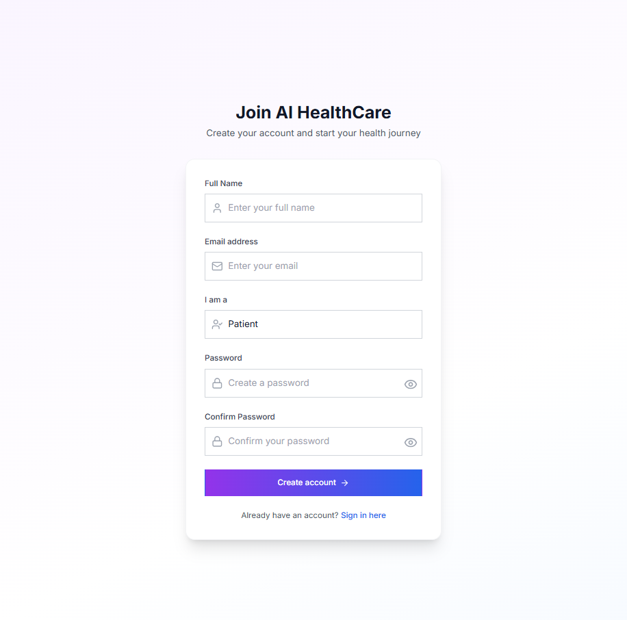
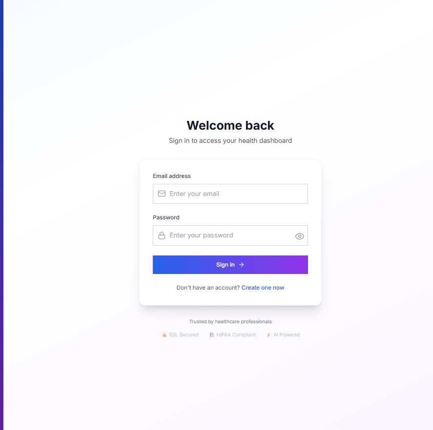
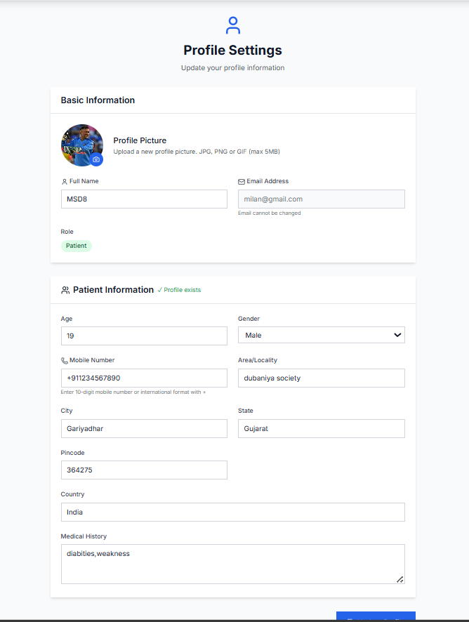
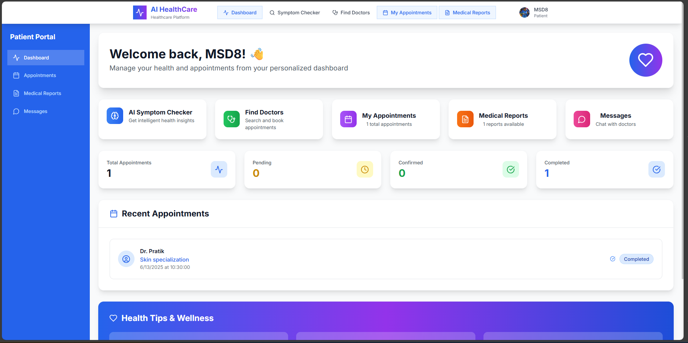
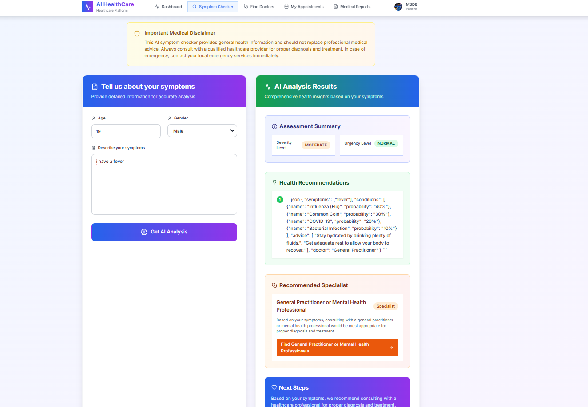
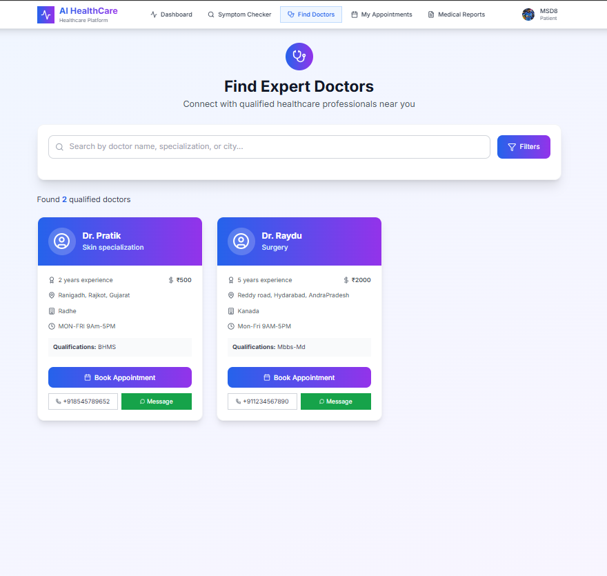
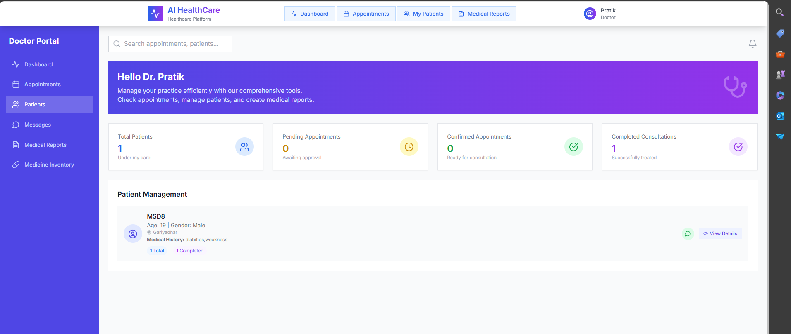
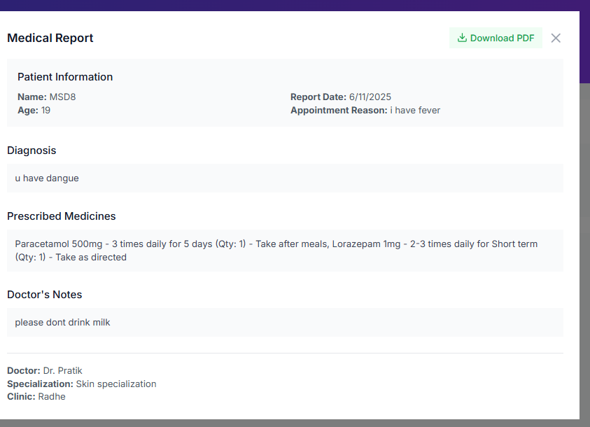
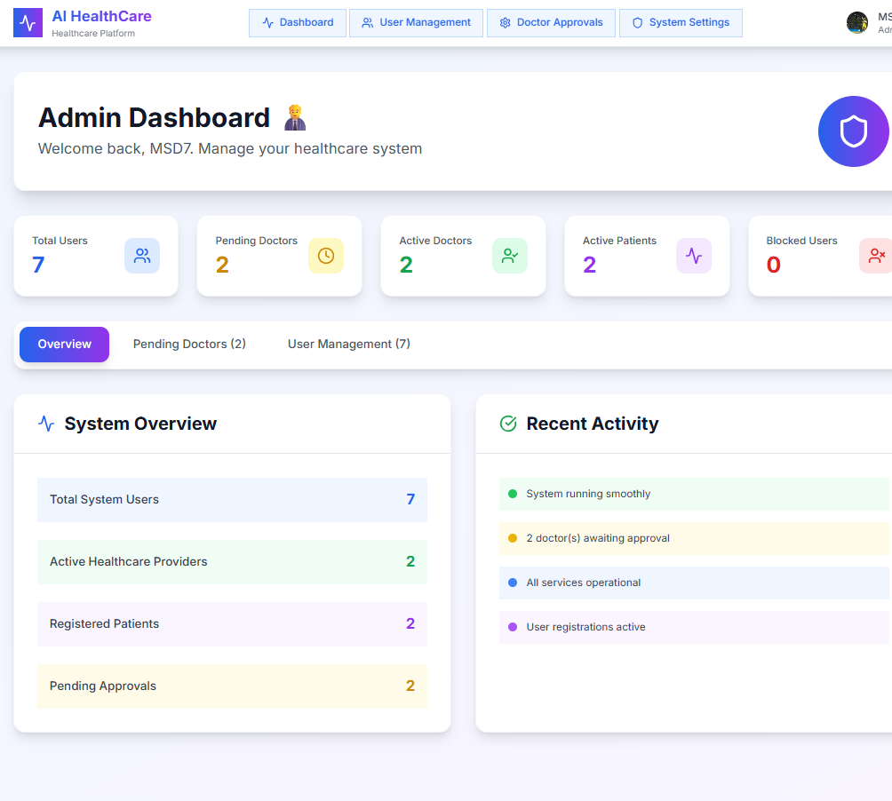

# AiSymptomChecker

AI-powered healthcare platform with role-based dashboards for Patients, Doctors, and Admins. Built with Spring Boot (Java 17) and a React js Frontend.

---

## 📑 Table of Contents

- [🌟 Features](#features)
- [🔐 Authentication Flow](#authentication-flow)
- [📊 Dashboard Features](#dashboard-features)
- [🛠️ Technology Stack](#technology-stack)
- [📱 API Documentation](#api-documentation)
- [📸 Screenshots](#screenshots)
- [🙏 Acknowledgments](#acknowledgments)

---

## 🌟 Features

- **Role-based authentication** for Patients, Doctors, and Admins
- **Doctor approval workflow** (Admin must approve new doctors)
- **Protected routes** and dashboards per role
- **Appointment booking and approval**
- **Medical report creation and management**
- **Real-time data sync** across dashboards
- **JWT token management with auto-refresh**
- **Robust API error handling and CORS support**

---

## 🔐 Authentication Flow

- **Role-based Login:** Users (patient/doctor/admin) are redirected to their respective dashboard after login.
- **Doctor Registration Approval:** Doctors must be approved by an admin before accessing system features.
- **Route Protection:** Each dashboard and API is protected according to user role with JWT security.
- **Automatic Token Refresh:** Smooth user experience with background token renewal.

---

## 📊 Dashboard Features

### Patient Dashboard
- Symptom checker, doctor finder
- Book/manage appointments
- Medical records and health tips
- Real-time appointment status
- Profile management

### Doctor Dashboard
- Patient list & statistics
- Approve/reject appointments
- Daily schedule & analytics
- Create/manage medical reports & prescribe medicines
- Income tracking & profile management

### Admin Dashboard
- Approve/reject doctor accounts
- System/user statistics & recent activity
- Comprehensive user management

---

## 🛠️ Technology Stack

- **Backend:** Spring Boot (Java 17), Spring Security, JWT, RESTful APIs
- **Frontend:** React.js+tailwind css
- **Database:** ( MySQL) 
- **Authentication:** JWT
- **Other:** CORS, Maven

---

## 📱 API Documentation

> (Document your REST endpoints here or link to Swagger/OpenAPI docs if available)

- **Base URL:** `http://localhost:8080/`
- **Endpoints include:**
  - `auth/login`
  - `auth/register`
  - `Api/patients/*`
  - `Api/doctors/*`
  - `Api/admin/*`
  - `Api/appointments/*`
  - `Api/medical-reports/*`
---

## 📸 Screenshots
- 
- 
- 
- 
- 
- 
- 
- 
- 
- 

---

## 🙏 Acknowledgments

Thanks to the contributors and the open-source community for inspiration and support.
